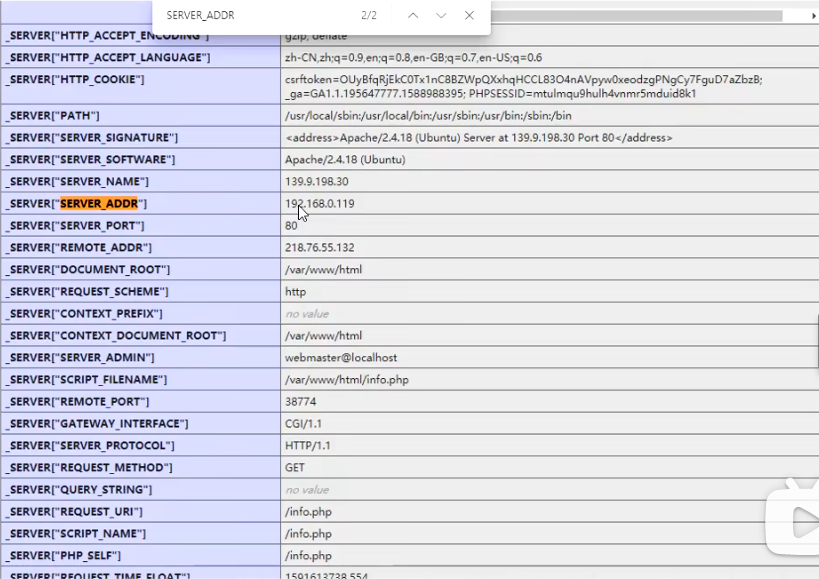

# Linux必备系统命令

## Linux基本常识

#### Linux目录结构

#### Linux远程登录

finalshell xshell secureCRT

#### Linux书籍推荐

《鸟哥的Linux私房菜》

《linux就该这么学》

## Linux常用命令

#### ls 显示当前目录下的所有文件

ls -l 列表形式展示文件

ls -a 显示所有文件（包括隐藏文件）

ls -h 按字节的形式展示文件大小

#### mkdir 创建目录

mkdir -p 递归创建子目录

#### cd 切换目录

cd .. 回到上一级目录

#### cp 复制文件

cp -r 递归赋值其子目录内的所有内容

cp 1.txt /2

#### touch 创建文件

#### mv 剪切文件

重命名：mv 1.py 2.py

#### pwd 显示当前目录

#### rm 删除文件

rm -r 递归删除子目录的所有内容

rm -f 强制删除

rm -rf /* 删库跑路

#### cat 显示文件内容

cat -n 显示行号

tac 逆序显示文件内容

#### more 显示文件内容

#### less 显示文件内容

#### head 显示文件头几行

head -n 显示前n行

#### tail 显示文件尾几行

tail -n 显示后n行

tail -f 动态显示后n行，不断刷新（可用于监控日志）

#### vim 文本编辑器

在命令模式下：

h（向左移动），l（向右移动），k（向上移动），j（向下移动）

搜索关键字：/关键字

n 向下查找关键字 N向上查找关键字

保存退出 wq 不保存退出 ！q

### 文件查找命令

#### find查找文件或目录

find <搜索范围> <匹配条件>

find -name 按文件名搜索

find -amin -n 在过去n分钟内被读取过

find -anewer file 比文件file更晚被读取过的文件

find -atime -n 在过去n天内被读取过的文件

find -cmin -n 在过去n分钟内被修改过

find -cnewer file 比文件file更新的文件

find -ctime -n 在过去n天内被修改过的文件

find -type 根据文件类型查找

find -type f   文件

find -type d  目录

find -type l   链接

#为了查找系统中所有文件长度为0的普通文件，并列出它们的完整路径

find / -type f -size 0 -exec ls -l {} \;

### 权限管理命令

#### chmod 更改文件权限

chmod +x 文件目录

chmod -R u+rwx 文件/文件夹

chmod -R g+rwx 文件/文件夹

chmod -R o+rwx 文件/文件夹

#### #授予用户、组、其他人对文件或文件夹的权限

chmod -R +777 文件/文件夹

#### 二进制权限 rwx = 4+2+1

### 压缩解压命令

#### gzip 压缩和解压缩.gz文件(不保留原文件)

gzip <文件>#压缩文件

gunzip/gzip -d <文件>#解压文件

#### zip 压缩和解压缩zip文件

zip -r<压缩后文件名><目录>

unzip<zip压缩文件>

#### tar 打包和压缩目录

tar -zcf<压缩后文件名><被压缩目录>#打包

tar -zxvf 压缩包文件名 #解压

-f 指定文件名

-v 显示详细信息

-z 打包/解包的同时压缩/解压（要放在选项的前面）（必须放在最前面）

### 网络命令

#### ping 测试网络连通性

#### ifconfig 查看当前网络配置信息

#### netstat 显示网络相关信息

netstat -tlun 查看本机监听的端口信息

netstat -rn 查看本机路由表

netstat -anp 查看所有端口信息

netstat -anpt 查看tcp的端口信息

### 查看进程

#### Ps  查看系统进程

ps aux 列出全部进程

a 查看其他用户的进程

x 查看自己的进程

u 显示进程的用户名和时间

#### 查看关于nginx的相关进程信息

ps aux | grep nginx 查找某个进程

grep 查找

ps -u 用户 指定进程用户查找

#### 查看指定用户的相关信息

ps -u root

#### Top 是一个实时刷新的进程信息

c 显示进程的完整命令

p cpu按降序的方式排序

M 按内存的占用大小来排序

q 退出

Ctrl+c 退出

### 其他命令

unname -a  查看当前操作系统的linux内核信息（经常会根内核版本来判断是否有本地提权的风险）

whoami 显示linux上当前已登录用户

id 显示当前已登录的用户和组

last 显示之前登录系统的用户信息

lastlog 显示之前登录系统的用户信息

uesradd 用户1 添加用户1

userdel  用户1 删除用户1

passwd 用户1 修改用户1密码

car /var/log 查看日志目录

history 查看历史操作命令

cat~/.bash_history 查看历史操作命令

#### crontab 计划任务

crontab -l 列出系统计划任务

crontab -e 进入编辑模式

crontab -u root -l 查看某个特点用户的
