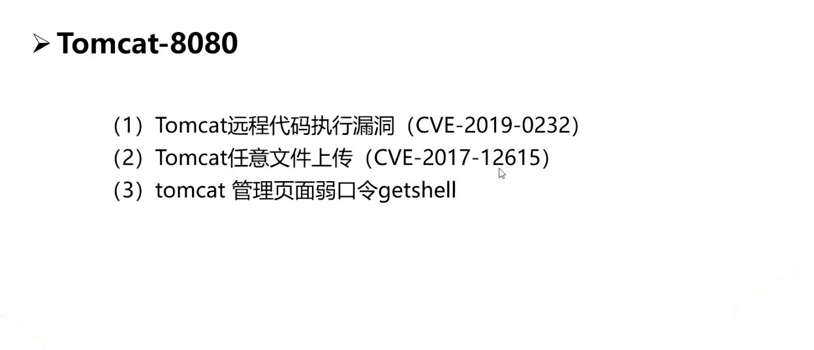

## 绕过CDN，拿到真实的IP地址

#### 判断CDN

站长之家对一个网站进行多地ping ，多地ping可帮助我们判断是否有CDN。

http://ping.chinaz.com

http://www.webkaka.com/Ping.aspx

#### 绕过CDN

1. 国外访问,如果外国ping均为一个IP地址，则该地址为真实IP地址。

​    https://asm.ca.com/en/ping.php

​    http://www.webkaka.com/Ping.aspx

2. 查询子域名的IP

3. 查看phpinfo文件

​     该方法可能性较小,很多网站没有该文件

4. Mx记录邮件服务

5. 查询历史DNS记录

## IP信息收集-C段存货主机探测

#### Nmap 

nmap -sP www.XXX.com/24  ||  nmap -sP 192.168.1.*

or

https://github.com/se55i0n/Cwebscanner

## 端口信息收集

根据服务类型的不同可分为以下两种端口：

TCP端口：面向连接的可靠的传输层通信协议

UDP端口：无连接的不可靠的传输层协议

TCP协议和UDP协议是独立的，因此各自的端口号也互相独立

端口类型：

周知端口：众所周知的端口号，范围：0-1023 如80端口是WWW服务

动态端口：一般不固定分配某种服务，范围：49152-65535

注册端口：范围：1024-49151，用于分配给用户进程或程序         

## Nmap介绍

Network Mapper，是一款开源的网络检测和安全审核的工具

[nmap参考指南]: https://nmap.org/map/zh/

#### 功能介绍

1. 检测网络存货主机（主机发现）
2. 检测主机开放端口（端口发现或枚举）
3. 检测相应端口软件（服务发现）版本
4. 检测操作系统，硬件地址，以及软件版本
5. 检测脆弱性的漏洞（nmap的脚本）

#### 端口状态

Open      端口开启，数据有到达主机，有程序在端口上监控

Closed    端口关闭，数据有到达主机，没有程序在端口上监控

Filtered  数据没有到达主机，返回的结果为空，数据被防火墙或IDS过滤

#### 基础用法

1. nmap -A -T4 192.168.1.1

2. 单一主机扫描 namp 192.68.1.2
3. 子网扫描 namp 192.168.1.1/24
4. 多主机扫描 nmap 192.168.1.1 192.168.1.10
5. 主机范围扫描 nmap 192.168.1.1-100
6. IP地址列表扫描 nmap -iL target.txt
7. 扫描除特定IP外的所有子网主机 nmap 192.168.1.1/24 --exclude 192.168.1.1
8. 扫描出文件中IP地址外的子网主机 nmap 192.168.1.1/24 --excludefile xxx.txt
9. 扫描特定主机上的80，21，23端口 nmap -p 80,21,23 192.168.1.1

#### 探测存货主机

1 探测存货主机

nmap -sn -v -T4 -0G Discovery.gnmap 172.26.1.0/24

grep "Status: Up"Discovery.gnmap | cut -f 2 -f '' > liveHost.txt

2 扫描全部短裤

nmap -sS -v -T4 -Pn -p 0-65535 -oN FullTCP -iL liveHosts.txt

3 扫描常用端口及服务信息

nmap -sS -T4 -Pn -oG TopTCP -iL LiveHosts.txt

系统扫描

nmap -O -T4 -Pn -oG OSDetect -iL LiveHosts.txt

版本检测

nmap -sV -T4 -Pn -oG ServiceGetect -iL LiveHosts.txt

4 namp漏洞扫描

nmap.exe -p445 -v --script smb-ghost 192.168.1.0/24

## 其他信息收集

#### 1 历史漏洞信息

 http://wy.zone.ci/

https://wooyun.kieran.top/#!/  乌云知识库

https://www/exploit-db.com/

https://wiki.0-sec.org/#/md

https://www/seebug.org/

#### 2 社会工程学

