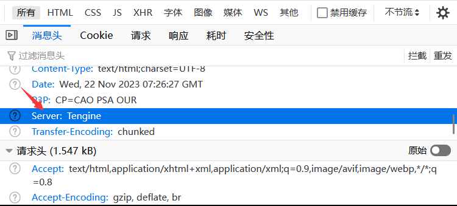

# 网站信息收集

网站最基本组成：服务器（操作系统），中间件（web容器），脚本语言，数据库。

## 操作系统判别

### ping判断

windows的TTL值一般为128，Linux为64。TTL大于100的一般为windows，几十的一般为Linux。

### nmap -O参数

### windows大小写不敏感，Linux区分大小写

## 网站服务\容器类型

#### F12查看响应头Server字段

F5刷新后

#### whatweb

https://www.whatweb.net/  与站长之家类似

#### wappalyzer插件（最方便的）

火狐，谷歌都有

//视频内容到此为止，请教学长后学长告诉我，这个视频对于我打CTF帮助不大，无奈只能先搁置，等基础牢固只后再继续学习，接下来主要以CTF为主。

